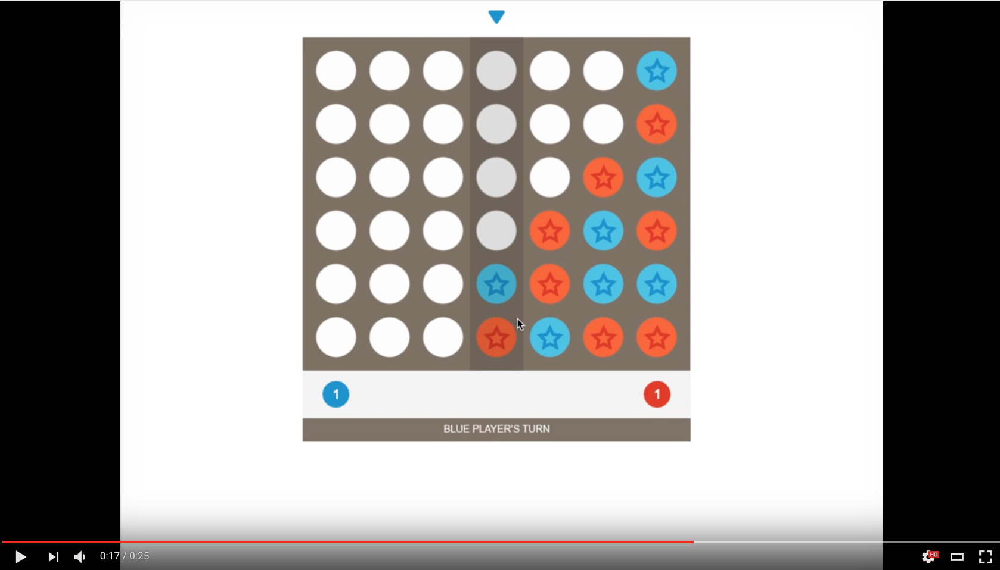

[](https://nodesecurity.io/orgs/mjelaska/projects/0c50fea3-e688-486d-b263-7bd89d01dda2)
[](https://david-dm.org/MiroslavJelaska/connect-four)

[](https://codeclimate.com/github/MiroslavJelaska/connect-four)
[](https://codeclimate.com/github/MiroslavJelaska/connect-four/coverage)
[](https://codeclimate.com/github/MiroslavJelaska/connect-four)
# Connect 4
Connect Four game created using Pixi.js and TypeScript.

Have some questions or want to give a feedback? You can send me a <a href="mailto:mjelaska.public@gmail.com">an email ✉️</a>

**NOTE:** Do you like it? Show it by giving a ⭐️. 🚀

[](https://youtu.be/J5EsdSgt2G0 "Preview of Connect 4 game (TypeScript & Pixi.js)")

⏱ How much time did it took me? 3 days (which is also partially visible in commit history). This includes software development as well as creating gamplay concept, prototypes and, finally, game art. I had no practical experience with TypeScript nor Pixi.js prior to this project. 

# Technical details
## How to build and run?
To build the project use **webpack** and then use some **static server** to serve the web.

### Step-by-step guide
Here is the whole process for those who got lost or those who are just starting out.

1. (Prerequirements) Assuming that you have installed and configured [node.js](https://docs.npmjs.com/getting-started/installing-node) and [git](https://git-scm.com/) on your machine. And that you have cloned this repository.
2. Open your favorite shell and change directory to _root_ at _./connect-four_
3. Install all npm modules (listed as dependencies in package.json).

   ```
   npm install
   ```
4. Run webpack to compile.

   ```
   npm run build
   ```
   
   and you should see something like this:
   
   ```
    Hash: 2a83d3d1cc776185f2cd
    Version: webpack 1.14.0
    Time: 2473ms
                      Asset     Size  Chunks             Chunk Names
    ./build/scripts/main.js  1.23 MB       0  [emitted]  main
        + 190 hidden modules
    ```
5. Install and use some static web server. E.g. install [Superstatic](https://github.com/firebase/superstatic), run superstatic at _./connect-four_. Shell output may look something like this
   
   ```
   Superstatic started.
   Visit http://localhost:3474 to view your app.
   ```
   
   Visit suggested web address to play the game.


# Game art design
Vector assets can be found in Adobe Illustrator file at  [readme-resources/Connect4-assets.ai](https://github.com/MiroslavJelaska/connect-four/blob/master/readme-resources/Connect4-assets.ai)

### Color scheme
*  `#FE5C2C` (LightRed)
*  `#E0331D` (DarkRed)
*  `#3DBAE3` (LightBlue)
*  `#0D87C9` (DarkBlue)
*  `#74675A` (Brown)
*  `#FFB014` (Yellow)
*  `#F1F2F2` (LightGray)
